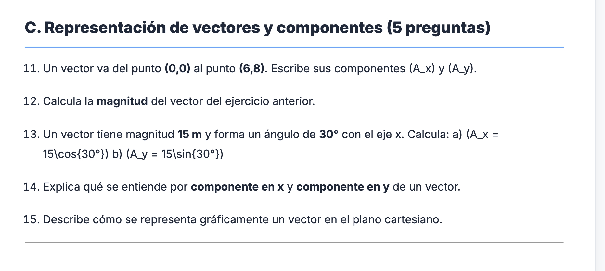
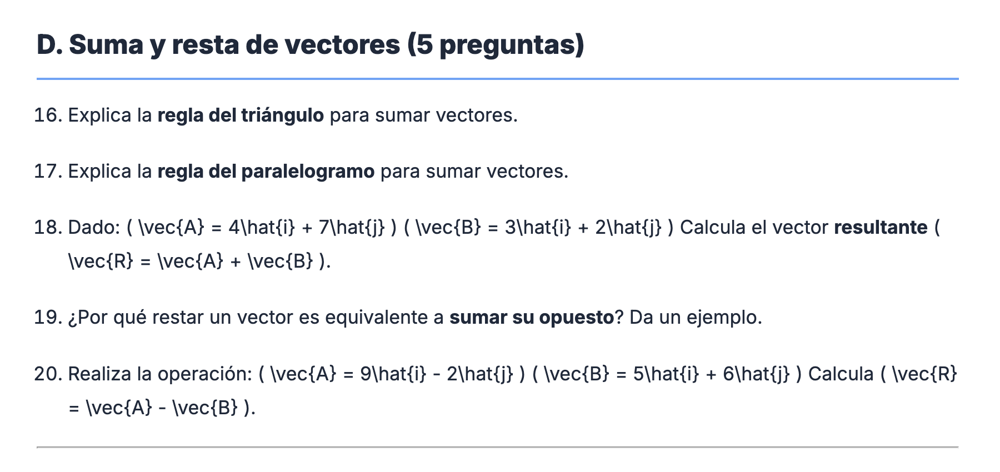
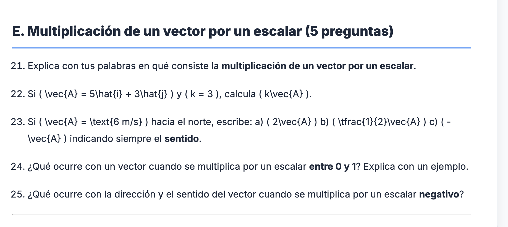

TODO EL LATEX ME HA RENDERIZADO CORRECTAMENT ECEPTO ESE QUE VES AHÍ QUE ESTÁ EN LA PÁGINA 06-taller-vectores.md en la carpeta 04-vectores, en la carpeta 01-introduccion, en la carpeta fisica.

QUIERO QUE ANALICES QUÉ SUCEDE, Y SI LA SOLUCIÓN A ESO DAÑARÍA LO OTRO QUE YA ESTÁ MONTADO. O QUÉ RECOMIENDAS.