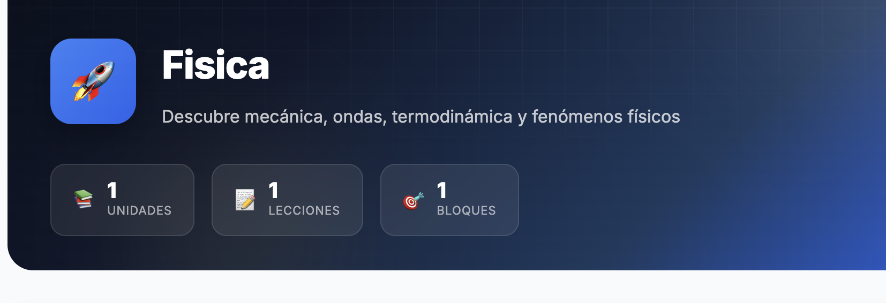
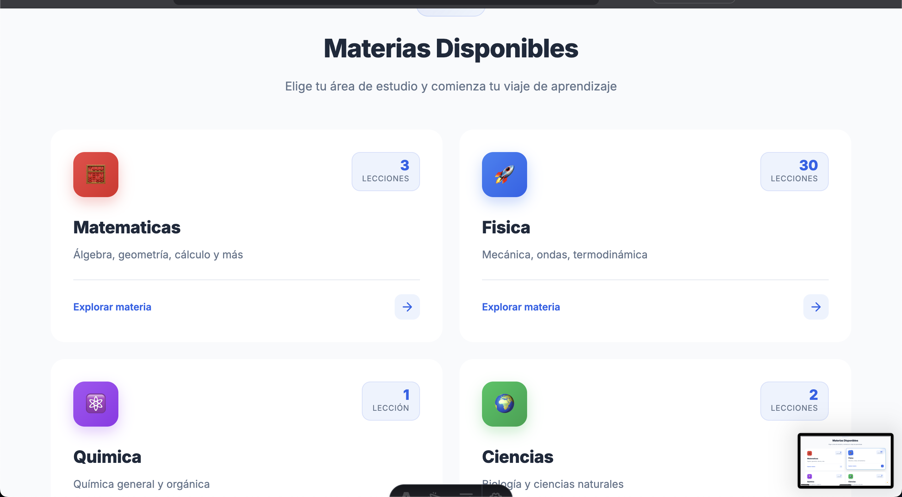

MEJORA EL DISEÑO EN CUANTO A EL USO DEL ANCHO, YA QUE SE QUEDA CORTO EN ESTA SECCIÓN DE LA PÁGINA PRINCIPAL O PUNTO DE ENTRADA DE MI WEB. MIRA POR EJEMPLO COMO SE VE ESTA OTRA SECCIÓN EN LA MISMA PÁGINA.

CON UN MEJOR USO DEL ANCHO.

EVALÚA TAMBIÉN EL RENDIMINETO DE LA PÁGINA, PARA QUE QUEDE AL MÁXIMO EN TODOS LOS TEST, Y QUE LA ROMPA CON EL SEO, PARA AHORA QUE VAYA A PRODUCCIÓN.